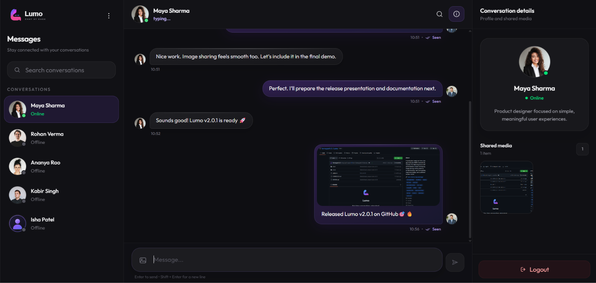
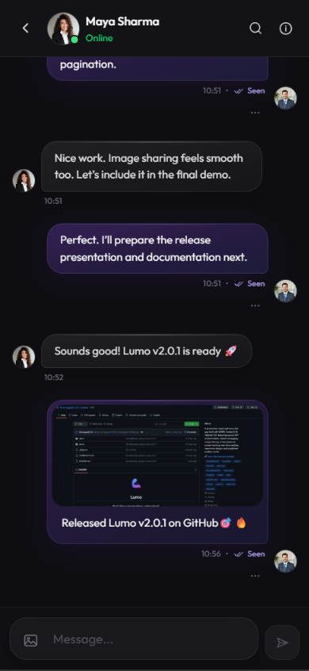

<div align="center">


# Lumo

### Real-time conversations, reimagined.

A modern, full-stack real-time messaging application built with the **MERN stack and Socket.IO**, featuring secure authentication, instant messaging, media sharing, message search, read receipts, responsive design, and a polished Lumo 2.0 interface.

<br />

[](https://lumo-chat-tanmay.vercel.app/)
[](https://github.com/Tanmaypatil-25/Lumo)
[](https://github.com/Tanmaypatil-25/Lumo/releases/tag/v2.0.1)

</div>

<br />

<div align="center">

### Desktop Experience

  
</div>

<br />

<div align="center">

### Responsive Mobile Experience



</div>

<br />

---

## Try the Live Demo

Experience Lumo's real-time messaging by opening the application in two browser windows and signing in with the demo accounts below.

| Account | Email | Password |
| --- | --- | --- |
| Aarav Mehta | `aarav.demo@example.com` | `LumoDemo@2026` |
| Maya Sharma | `maya.demo@example.com` | `LumoDemo@2026` |

> Demo conversations are shared publicly. Please avoid entering personal or sensitive information.

### Quick Demo Flow

1. Open Lumo in two browser windows.
2. Sign in using Aarav and Maya’s demo accounts.
3. Send a message to observe real-time delivery, typing indicators and Seen status.
4. Try image sharing, message search, editing and deletion.

<div align="center">

[](https://lumo-chat-tanmay.vercel.app/)

</div>

---

## About Lumo

**Lumo** is a full-stack real-time messaging application designed to provide a fast, secure, and polished communication experience.

What started as a MERN + Socket.IO chat application has evolved into a more production-oriented project with authenticated real-time connections, message synchronization, media handling, pagination, search, responsive layouts, accessibility improvements, and a complete custom visual identity.

**Lumo 2.0** introduces a redesigned interface built around a modern dark visual system with glass-inspired surfaces, refined interactions, responsive navigation, and consistent behavior across desktop and mobile devices.

---

## Features

- Secure real-time one-to-one messaging
- Typing indicators, online presence and read receipts
- Message editing, deletion and conversation search
- Cursor-based message history pagination
- Cloudinary-powered image sharing
- Responsive, accessible Lumo 2.0 interface

<details>
<summary><strong>View complete feature list</strong></summary>

### Real-Time Messaging

- Real-time one-to-one messaging using Socket.IO
- Instant text message delivery
- Real-time image messaging
- Image messages with captions
- Online and offline presence indicators
- Real-time typing indicators
- Sent and Seen message status
- Multi-session message synchronization

### Message Management

- Edit previously sent messages
- Real-time edited message synchronization
- Edited message indicator
- Delete sent messages
- Real-time message deletion
- Cloudinary cleanup for deleted image messages
- Message ownership validation

### Search & Conversation History

- Search messages inside a conversation
- Case-insensitive partial message matching
- Navigate directly between search results
- Search highlighting inside conversations
- Cursor-based message pagination
- Load older conversation history dynamically
- Viewport preservation while loading older messages

### Media Sharing

- Image upload and sharing
- Optional image captions
- Media type validation
- Image size validation
- Shared media gallery
- Cloudinary-powered media storage
- Automatic Cloudinary cleanup when supported image messages are deleted

### Authentication & Security

- User signup and login
- JWT-based authentication
- Protected REST API routes
- Authenticated Socket.IO handshakes
- Socket identity validation
- JWT expiration handling
- Sender ownership validation
- Receiver authorization for Seen updates
- User and message ID validation
- Message length restrictions
- Environment variable validation
- Restricted Socket.IO origin configuration

### User Experience

- User search in the conversation sidebar
- Unread message counts
- Conversation loading states
- Empty conversation states
- API error states with retry support
- Profile editing
- Profile image updates
- Live profile preview
- Responsive conversation navigation
- Full-screen mobile conversation details
- Touch-friendly interactions

### Lumo 2.0 Interface

- Complete custom Lumo visual identity
- Custom logo, wordmark, favicon, and default avatar
- Modern dark interface
- Glass-inspired surfaces and depth
- Responsive mobile, tablet, and desktop layouts
- Redesigned sidebar
- Redesigned conversation header
- Redesigned message bubbles
- Redesigned message composer
- Redesigned authentication experience
- Redesigned profile settings
- Redesigned conversation details
- Compact media message cards
- Refined typography and spacing
- Consistent interaction states
- Subtle transitions and motion

### Accessibility

- Keyboard-friendly controls
- Accessible form labels
- Improved focus behavior
- Accessible search interactions
- Accessible dialog semantics
- Improved status and loading feedback
- Reduced-motion support
- Improved touch targets
- Keyboard and touch-friendly message actions

</details>

---

## Tech Stack

### Frontend

| Technology | Purpose |
| --- | --- |
| React | User interface |
| Vite | Frontend tooling and build system |
| Tailwind CSS | Styling and responsive design |
| React Router | Client-side routing |
| Axios | HTTP communication |
| Socket.IO Client | Real-time communication |
| React Hot Toast | Application notifications |

### Backend

| Technology | Purpose |
| --- | --- |
| Node.js | Server runtime |
| Express.js | REST API |
| Socket.IO | Real-time messaging |
| JWT | Authentication |
| bcryptjs | Password hashing |
| Mongoose | MongoDB object modeling |

### Database & Cloud

| Technology | Purpose |
| --- | --- |
| MongoDB Atlas | Cloud database |
| Cloudinary | Image storage and management |
| Vercel | Application deployment |

---

## Architecture

Lumo separates the application into a React frontend and a Node.js/Express backend.

```text
                         ┌─────────────────────┐
                         │       Client        │
                         │                     │
                         │   React + Vite      │
                         │   Tailwind CSS      │
                         └─────────┬───────────┘
                                   │
                         REST API  │  Socket.IO
                                   │
                         ┌─────────▼───────────┐
                         │       Server        │
                         │                     │
                         │ Node.js + Express   │
                         │ Socket.IO           │
                         └──────┬────────┬─────┘
                                │        │
                   ┌────────────┘        └────────────┐
                   │                                  │
          ┌────────▼────────┐                ┌────────▼────────┐
          │  MongoDB Atlas  │                │   Cloudinary    │
          │                 │                │                 │
          │ Users           │                │ Profile Images  │
          │ Messages        │                │ Message Media   │
          └─────────────────┘                └─────────────────┘
```

### REST API

The REST API handles operations such as:

- Authentication
- User profile management
- Conversation retrieval
- Message history
- Message pagination
- Message search
- Sending messages
- Editing messages
- Deleting messages
- Seen-state updates

### Socket.IO

Socket.IO handles real-time events such as:

- New messages
- Message updates
- Message deletion
- Typing indicators
- Seen receipts
- Online presence
- Multi-session synchronization

---

## Real-Time Message Flow

```text
User A
  │
  │ Send Message
  ▼
React Client
  │
  │ HTTP Request
  ▼
Express API
  │
  ├──────────────► MongoDB
  │                 Save Message
  │
  ▼
Socket.IO Server
  │
  │ Real-time Event
  ▼
User B
```

Messages are persisted in MongoDB while Socket.IO is used to deliver real-time updates to connected clients.

This keeps conversation history persistent while still providing immediate message delivery.

---

## Security

Lumo includes several improvements beyond a basic chat application:

- JWT authentication for protected API routes
- Authenticated Socket.IO connections
- Server-side socket identity validation
- Password hashing using bcryptjs
- JWT expiration handling
- Message ownership validation for editing
- Message ownership validation for deletion
- Receiver authorization for Seen updates
- Message and user ID validation
- Message length restrictions
- Image type validation
- Image size validation
- Environment variable validation
- Restricted Socket.IO CORS configuration

Authentication is validated by the backend rather than trusting a user ID supplied directly by the client.

---

## Performance & Reliability

Several optimizations were introduced as Lumo evolved:

- Cursor-based message pagination
- MongoDB indexes for frequently queried message fields
- Aggregated unread message handling
- Reduced unnecessary frontend data fetching
- React context memoization
- Stable callback handling
- Multi-tab socket presence management
- Pagination request protection
- Scroll-position preservation during history loading
- Consistent API responses
- Centralized configuration
- Centralized Cloudinary operations

These improvements allow conversations to grow without requiring the complete message history to be fetched every time a chat is opened.

---

## Project Structure

```text
Lumo/
│
├── client/
│   ├── public/
│   ├── src/
│   │   ├── assets/
│   │   │   └── branding/
│   │   ├── components/
│   │   └── pages/
│   ├── package.json
│   └── package-lock.json
│
├── server/
│   ├── controllers/
│   ├── middleware/
│   ├── models/
│   ├── routes/
│   ├── socket/
│   ├── services/
│   ├── package.json
│   └── package-lock.json
│
├── CHANGELOG.md
├── README.md
└── .gitignore
```

> The structure above highlights the major architectural areas of the project. Individual configuration and utility files have been omitted for readability.

---

## Getting Started

### Prerequisites

Make sure you have the following installed:

- Node.js
- npm
- Git

You will also need access to:

- MongoDB
- Cloudinary

---

### 1. Clone the Repository

```bash
git clone https://github.com/Tanmaypatil-25/Lumo.git
cd Lumo
```

### 2. Install Frontend Dependencies

```bash
cd client
npm install
```

### 3. Install Backend Dependencies

```bash
cd ../server
npm install
```

### 4. Configure Environment Variables

Create local environment files from the provided examples:

```bash
cp client/.env.example client/.env
cp server/.env.example server/.env
```

Configure the frontend:

```env
VITE_BACKEND_URL=http://localhost:5000
```

Configure the backend:

```env
MONGODB_URI=your_mongodb_connection_string
JWT_SECRET=your_secure_jwt_secret

CLIENT_URL=http://localhost:5173

CLOUDINARY_CLOUD_NAME=your_cloudinary_cloud_name
CLOUDINARY_API_KEY=your_cloudinary_api_key
CLOUDINARY_API_SECRET=your_cloudinary_api_secret

PORT=5000
```

> Keep `.env` files private. Only the placeholder `.env.example` files should be committed.

### 5. Start the Backend

From the `server` directory:

```bash
npm run server
```

### 6. Start the Frontend

Open another terminal and run:

```bash
cd client
npm run dev
```

The frontend will then be available through the local Vite development server.

---

## Deployment

Lumo is deployed using Vercel.

### Live Application

**Lumo 2.0:**  
https://lumo-chat-tanmay.vercel.app/

### Backend

The backend API is deployed separately and communicates with the frontend through configured environment variables.

Production Socket.IO connections use authenticated WebSocket communication between the client and backend.

---

## Releases

### Lumo v2.0.1

A focused patch release that improves mobile viewport stability:

- Fixed mobile Chrome viewport sizing
- Kept the conversation header and composer visible
- Prevented outer-page overscroll
- Improved layout stability when browser controls expand or collapse

### Lumo v2.0.0

Lumo 2.0 introduces the complete product experience overhaul, including:

- New Lumo brand identity
- Complete UI/UX redesign
- Responsive mobile experience
- Redesigned authentication
- Redesigned profile settings
- Improved message interactions
- Improved media messages
- Accessibility improvements
- Reduced-motion support
- Interaction polish
- Conversation-history scroll preservation

### Lumo v1.0.0

The first production-oriented release established Lumo's core engineering foundation:

- Secure authentication
- Authenticated Socket.IO
- Real-time messaging
- Typing indicators
- Read receipts
- Message editing and deletion
- Image messaging
- Message search
- Cursor-based pagination
- Security improvements
- Performance improvements
- Architecture cleanup

For the complete release history, see [CHANGELOG.md](./CHANGELOG.md).

---

## Roadmap

Potential future improvements include:

- Redis-backed presence and Socket.IO scaling
- Group conversations
- Friend/contact system
- Message reactions
- Reply-to-message support
- Voice messages
- File attachments
- Push notifications
- Improved media management
- Additional automated testing

---

## Engineering Focus

Lumo is more than a UI-focused chat application. The project was developed with attention to:

```text
Security
   ↓
Reliability
   ↓
Data Consistency
   ↓
Performance
   ↓
Architecture
   ↓
Real-Time Features
   ↓
Responsive UI/UX
   ↓
Accessibility
```

The goal was to evolve the project from a basic real-time messaging application into a cleaner, more maintainable, secure, and portfolio-ready full-stack product.

---

## Author

<div align="center">

### Tanmay Patil

Full-Stack Web & Android Developer  
Information Technology Undergraduate

<br />

[](https://github.com/Tanmaypatil-25)
[](https://www.linkedin.com/in/tanmayppatil25/)
[](https://leetcode.com/u/tanmaypatil_25/)

</div>


---

<div align="center">


### Lumo

**Built with React, Node.js, MongoDB & Socket.IO**

<sub>Designed and developed by Tanmay Patil.</sub>

</div>